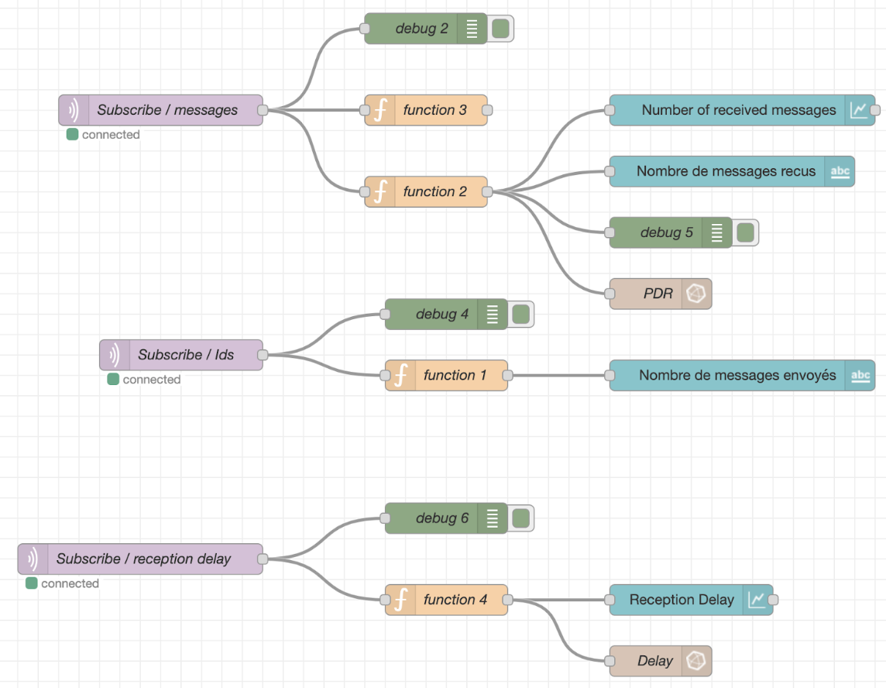

# Déploiement

Ce document décrit les étapes nécessaires pour le déploiement en utilisant Docker, y compris la manière de cloner le dépôt et de construire des images Docker personnalisées pour Node-RED, InfluxDB et Grafana.

## Prérequis

- Docker doit être installé sur votre machine.

## Instructions

### 1. Installer Docker

Pour installer Docker sur votre machine, ouvrez un terminal et exécutez la commande suivante :

```bash
sudo apt install -y docker.io
```

### 2. Cloner le dépôt

Une fois Docker installé, clonez le dépôt `Deployment-NB-IOT` de l'organisation `SSIO-NB-IOT` avec la commande suivante :

```bash
git clone https://github.com/SSIO-NB-IOT/Deployment-NB-IOT.git
```

### 3. Construire les images Docker personnalisées

#### a. Node-RED

Pour construire l'image personnalisée de Node-RED, naviguez dans le dossier approprié et utilisez le `Dockerfile` fourni :

```bash
FROM nodered/node-red:latest

COPY flows.json /data/flows.json

ENV FLOWS=flows.json

RUN npm install node-red-contrib-influxdb node-red-dashboard
```
Pour construire l'image node-red:

```bash
docker build -t node-red-custom . 
```


## Vérification de l'Image Docker

Pour confirmer que l'image Docker `node-red-custom` existe sur votre machine, vous pouvez utiliser la commande suivante dans un terminal :

```bash
docker images
```

Cette commande liste toutes les images Docker installées, y compris `node-red-custom` si elle a été correctement construite et est présente.

## Contenu de l'Image Docker Customisée de Node-RED

L'image Docker personnalisée de Node-RED inclut les éléments suivants préconfigurés :

- **`flows.json`** : Le fichier de configuration principal utilisé par Node-RED.
- **Packages supplémentaires** : Deux packages Node-RED sont préinstallés :
  - `node-red-contrib-influxdb` : Un package pour l'intégration avec InfluxDB.
  - `node-red-dashboard` : Un package pour créer des tableaux de bord UI dans Node-RED.

## Test de l'Image Docker Customisée

En lançant un conteneur basé sur l'image `node-red-custom`, vous devriez obtenir un environnement Node-RED avec :
- Un flow existant prédéfini, comme décrit par le fichier `flows.json`.
- Les packages `node-red-contrib-influxdb` et `node-red-dashboard` déjà installés et prêts à l'emploi.



Idem pour l’image docker d’influxdb notre base de donnée temporelle.
On a mis la configuration de notre bdd dans le Dockerfile:

```bash
docker build -t influxdb-custom .
```
Si on lance localement l’image d’influxdb:

```bash
FROM influxdb:2.0

ENV DOCKER_INFLUXDB_INIT_MODE=setup
ENV DOCKER_INFLUXDB_INIT_USERNAME=admin
ENV DOCKER_INFLUXDB_INIT_PASSWORD=admin1234
ENV DOCKER_INFLUXDB_INIT_ORG=nb_iot
ENV DOCKER_INFLUXDB_INIT_BUCKET=measures
ENV DOCKER_INFLUXDB_INIT_RETENTION=1w
ENV DOCKER_INFLUXDB_INIT_ADMIN_TOKEN=token
```
On met: username : admin et password : admin1234
On remarque que notre bucket est crée.

notre bucket par défaut: measures où on va injecter nos données
Pour avoir une image Grafana customisée on a met en place un workflow avec GitHub Actions. Chaque fois on fait un changement sur le code source de grafana une nouvelle image est constituée avec une version latest : 

Cette image est publiée directement sur Docker Hub.
On peut fair un pull directement depuis notre terminal pour avoir l’image grafana:

```bash
docker pull benayyad12/grafana-nb-iot 
```
Cette image contient les dashboards avec la datasource influxdb

```bash
FROM grafana/grafana:latest


ENV GF_USERS_DEFAULT_THEME=light

ENV GF_AUTH_ANONYMOUS_ENABLED=true

COPY ./grafana/dashboard.yaml /etc/grafana/provisioning/dashboards/main.yaml
COPY ./grafana/dashboards /var/lib/grafana/dashboards
COPY ./grafana/provisioning /etc/grafana/provisioning/datasources


VOLUME ["var/lib/grafana","/etc/grafana","/etc/grafana/provisioning/datasources"]

EXPOSE 3000

CMD ["grafana-server"]
```

En lançant cette image pour le test:
On met : username: admin et password: admin

On trouve aussi notre datasource influxdb qui utilise Flux comme langage query
il faut juste connecter influxdb avec les dashbaords

il faut juste stocker les données sur influxdb et l’utiliser depuis le bucket measures
Enfin on obtient les dashboards dynamiques.

On peut lancer maintenant notre Docker compose file:

```bash
cd docker-compose-iot
```
```bash
docker-compose up -d (mode détaché)
```
pour arrêter et supprimer les volumes et les conteneurs: 

```bash
docker-compose down -v 
```


